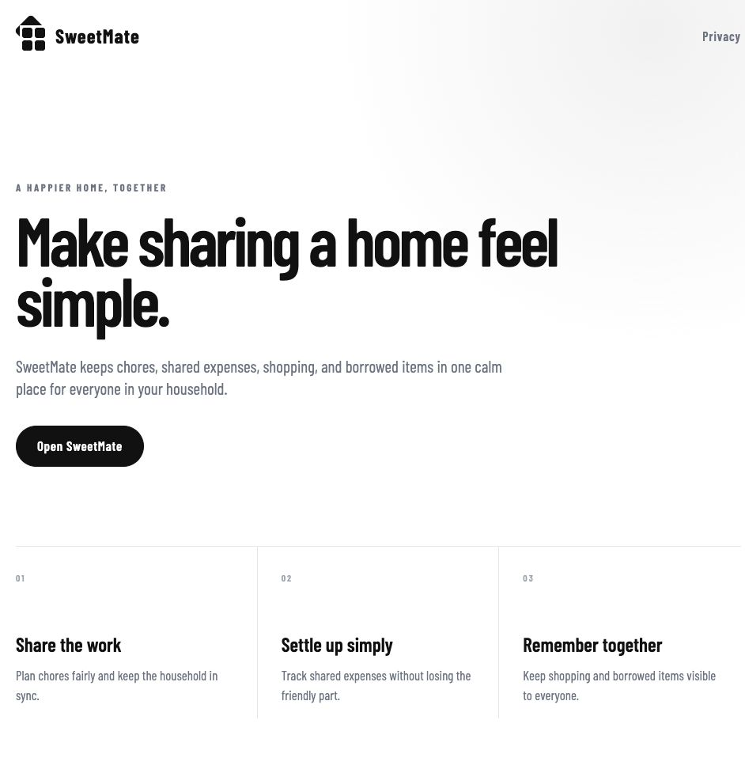

# SweetMate

**A happier home, together.** SweetMate helps roommates share the work of running a home—chores, expenses, shopping, and borrowed items—in one mobile app.

[Try the iOS beta on TestFlight](https://testflight.apple.com/join/Ee5PRBzr) · [Visit the product website](https://sweetmate.info) · [Explore the source](https://github.com/lianawarnaku/SweetMate)

Shared living often means scattered group chats, forgotten tasks, and uncertainty about who owes what. SweetMate brings those everyday decisions into a shared household workspace, with a personal view of what needs attention next.

## What you can do

- **Share the work:** assign recurring chores, plan rotations, and see personal and household progress.
- **Keep money clear:** track shared expenses, splits, and outstanding balances.
- **Shop together:** organize shared lists and see what still needs buying.
- **Keep track of borrowed items:** record loans, due dates, and returns.
- **Set up a household:** invite roommates and plan the essentials for a shared home.
- **Make it yours:** choose light or dark appearance, accent colors, and optional points and rankings.

## Try SweetMate

Open the [public TestFlight invitation](https://testflight.apple.com/join/Ee5PRBzr) on your iPhone, install Apple’s TestFlight app, and follow the invitation to install SweetMate. The link serves the latest build approved and enabled for external testing; it may lag behind `main`. Share feedback through TestFlight.

## Product preview



*Live companion website, captured September 13, 2026. The website is a product overview; “Open SweetMate” launches the installed app. It is not an interactive browser demo.*

## Stack

| Layer | Technology |
| --- | --- |
| Mobile | Expo, React Native, Expo Router, TypeScript |
| Interface | Shared design tokens, native Liquid Glass where supported, blur fallback |
| State and data | React Context, AsyncStorage, Supabase Auth, PostgreSQL and Realtime |
| API | Express, Zod, OpenAPI, Orval-generated clients |
| Companion website | React, Next.js APIs via Vinext, Cloudflare Workers |
| Workspace | pnpm, TypeScript, Node.js tests |

## Inside the project

- [`artifacts/mobile`](artifacts/mobile): app screens, components, household state and business-logic tests.
- [`artifacts/api-server`](artifacts/api-server): authenticated API routes and integrations.
- [`lib/api-spec`](lib/api-spec): OpenAPI source of truth and client generation.
- [`supabase/migrations`](supabase/migrations): database schema and access policies.
- [`homie-web`](homie-web): companion website.

## Local development

Use Node.js 22.13 or newer and pnpm. Install workspace dependencies with `pnpm install`. Copy [`artifacts/mobile/.env.example`](artifacts/mobile/.env.example) to `artifacts/mobile/.env` and configure your own Supabase project and API URL. Authenticated household features require the corresponding database migrations and backend configuration.

```bash
# Start Expo locally
pnpm --filter @workspace/mobile exec expo start

# Check types and run the mobile logic tests
pnpm run typecheck
pnpm --filter @workspace/mobile run test
```

The companion website has its own setup instructions in [`homie-web/README.md`](homie-web/README.md). Historical package names and identifiers may still use **Homie**; the product is branded **SweetMate**.
